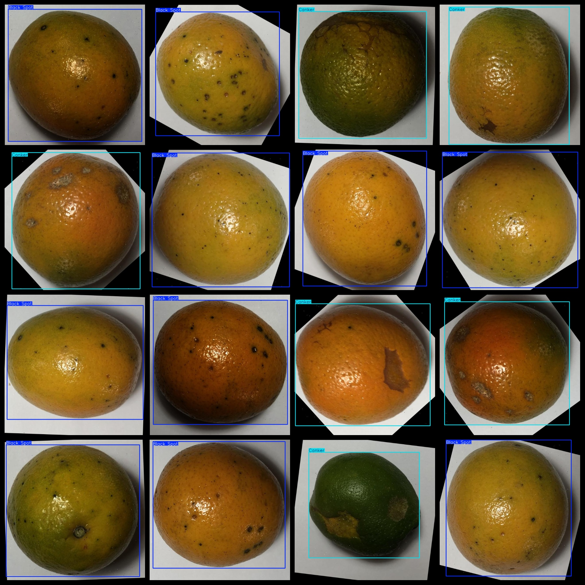
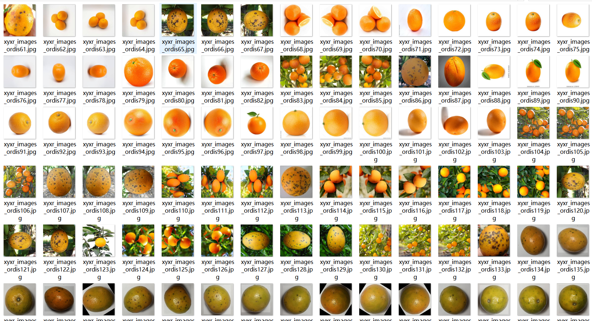

# Tangerine Disease Dataset: 5506 Images in YOLO+VOC Format

The Tangerine Disease Dataset consists of 5506 images in both YOLO and VOC formats. The dataset is organized into three folders, each containing images, XML files, and TXT files.

The JPEGImages folder contains a total of 5506 JPEG images.

The Annotations folder contains a total of 5506 XML files.

The labels folder contains a total of 5506 TXT files.

There are a total of 3 categories in the labels: "Black Spot", "Canker", and "Healthy".

The categories are "spots", "ulcers", and "health".

Each category has a set of bounding boxes (boxes) as specified in the labels folder's classes.txt file. Here are the box counts for each category:

- Black Spot boxes count = 3027
- Canker boxes count = 2390
- Healthy boxes count = 228

Total bounding boxes count = 5645

The image resolution is clear, with a high level of detail.

Images have been enhanced for training purposes.

The shape of the bounding boxes is a rectangle, used for target detection recognition.

It is important to note that this dataset does not guarantee the accuracy or precision of any trained models or weight files. The dataset only provides accurate and reasonable annotations.

The annotation and image details are as follows:
## Images

---

Here is a pay link on Stripe (https://buy.stripe.com/3cs8yP7sY87d0vu9AB). Please contact me lonlonago@foxmail.com after funding $89, and I will send you a complete data files, thank you!

